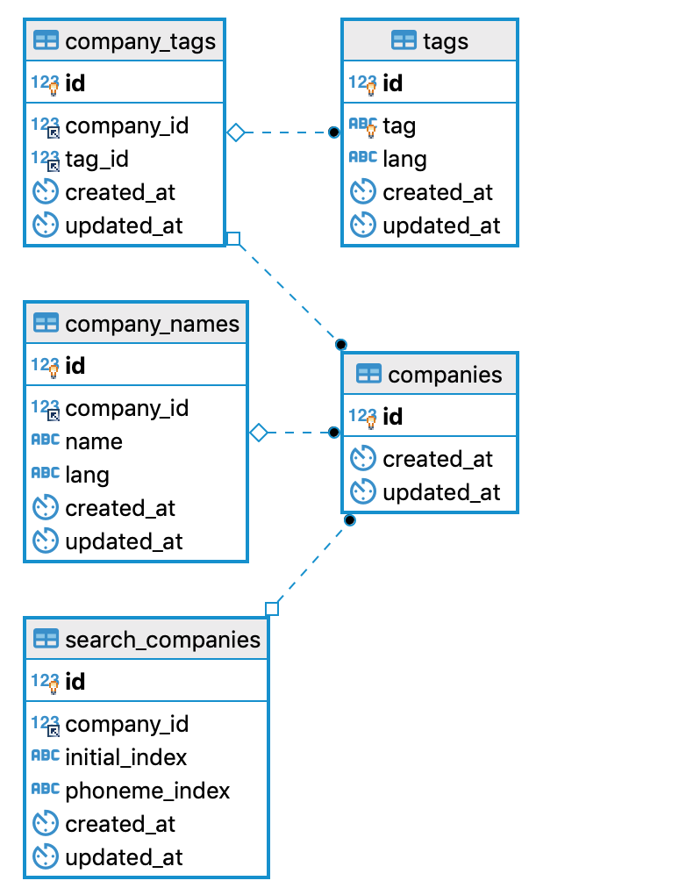

### 환경 셋업 및 실행
1. Docker 가 설치되어있지 않다면,각 환경에 맞는 [Docker 설치](https://docs.docker.com/install/)를 진행하여 주세요.
2. ```$ docker-compose up --build``` 명령어를 통해 도커서버를 실행하여주세요.
    - **마이그레이션 작없이 있어 컨테이너 띄우는데 시간이 걸릴수 있습니다.**

### API 명세

#### 1. 회사명 자동완성 검색(초성 검색, Like 검색)
    - GET /v1/search/companies?q=&type=company

|query param   | type  | required  | default  |
|---|---|---|---|
| q  | str  | True |   | 
| type | str  |  False |  company | 

    - StatusCode: 200
    - Response json data
    {
        "companies: [
            {"id": int,
            "names": [
                {"name": str,
                "lang": str
                }],
            "tags": [
                {"id": str,
                "tag": str,
                "lang": str
            }]
    }
    
#### 2. 회사명 태그 검색(equal 검색)
    - GET /v1/search/companies?q=&type=tag
|query param   | type  | required  | default  |
|---|---|---|---|
| q  | str  | True |   | 
| type | str  |  True |   | 
   
    - StatusCode: 200
    - Response json data
    {
        "companies: [
            {"id": int,
            "names": [
                {"name": str,
                "lang": str
                }],
            "tags": [
                {"id": str,
                "tag": str,
                "lang": str
            }]
    }

#### 3. 회사 태그 등록
    - POST /v1/companies/<int:company_id>/tags
    json data
    {   
        "name": str,
        "lang": str
    }
    
    - StatusCode: 201
    - Response json data
    {}
    

#### 4. 회사 태그 삭제
    - DELETE /v1/companies/<int:company_id>/tags/<int:tag_id>

    - StatusCode: 200
    - Response json data
    {}
    
### ERD

